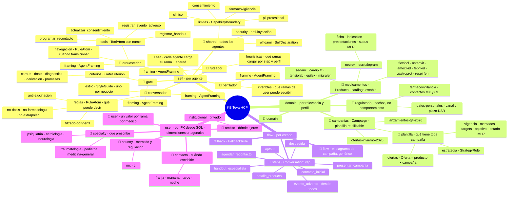
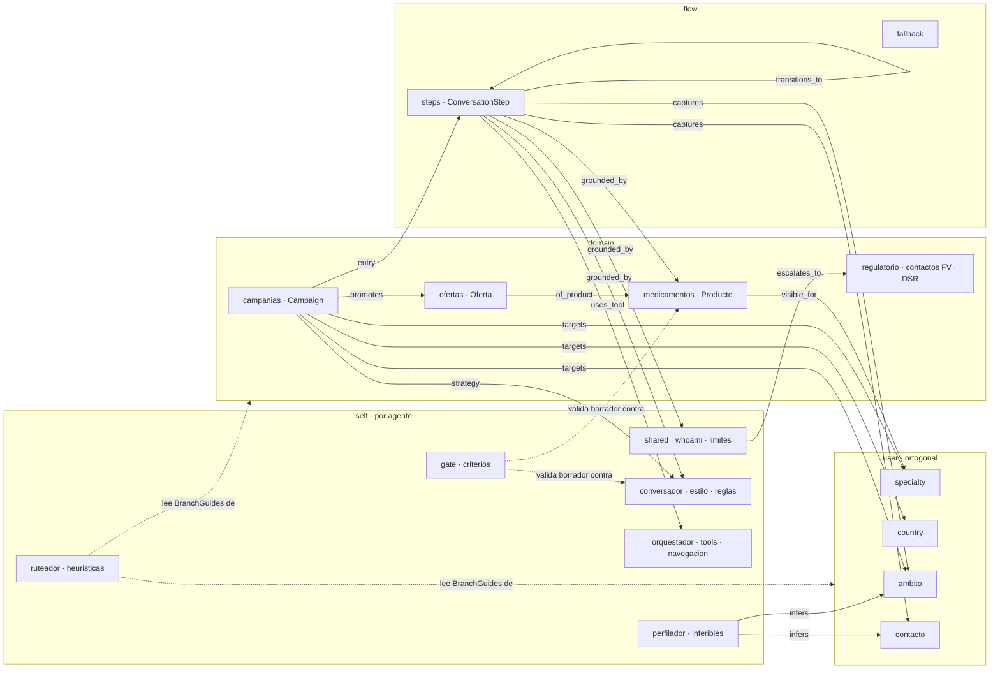

# Ontología de la KB HCP — propuesta v2 (2026-09-09)

KB pensada en campañas, sin herencia del PSP ni de Vitali/Don Peppe. Cuatro familias
(`self`, `domain`, `flow`, `user`), cada rama con un nodo guía que explica a sus hijos, y
las **relaciones entre familias y ramas modeladas como tipos de relación de kgdb**.

Cambios respecto de la v1, por feedback del 2026-09-09:

- `self` es **selectivo por agente**: cada agente carga su rama más la compartida. Así el
  comportamiento se programa en la KB. Los criterios del gate pasan a `self:gate`; deja de
  haber familia `gate`.
- `domain` tiene **dos ramas grandes**: `campanias` y `medicamentos`. La campaña es una
  plantilla reutilizable que referencia productos; los productos se reutilizan entre campañas.
- `conversation` pasa a llamarse **`flow`**: es lo específico del diagrama de conversación.
- `user` con traits **ortogonales**: una rama por dimensión, un valor por médico, hojas
  mutuamente excluyentes, dimensiones independientes entre sí.

## 1. Familias: activación y contenido

| Familia | Se activa por | Qué contiene |
|---|---|---|
| `self:` | **el rol del agente que compila** + `self:shared` siempre | comportamiento: identidad, límites, estilo, criterios, tools, heurísticas |
| `domain:` | relevancia a la pregunta **y perfil del médico** | hechos: campañas y medicamentos (más un mínimo regulatorio) |
| `flow:` | estado de sesión (step activo) | el diagrama: steps, transiciones, fallback |
| `user:` | FK desde SQL (`user_traits`) | dimensiones de segmentación del médico |

Transversales sin nodos: `system:teva-hcp`, `channel:whatsapp`, `status:mlr.*`.

## 2. El árbol



Lo que **no** es trait, porque no es una característica estable del médico: consentimiento,
estado por campaña (pendiente / contactado / interesado / recontacto / baja), fecha de
recontacto. Eso es estado en SQL (membresía médico × campaña, consentimientos, recontactos).

## 3. `self` selectivo por agente

Regla de compilación: el agente con rol `R` recibe `self:shared.*` ∪ `self:R.*`. Nada más de
`self`. Esto reemplaza el framing suelto de hoy (`agent-hcp-*`) por una rama completa por
agente, y hace que agregar comportamiento sea agregar átomos, no tocar código.

| Agente | Carga | Efecto |
|---|---|---|
| conversador | shared + estilo + reglas | redacta con la voz y los límites de Antonia |
| orquestador | shared + tools + navegación | decide transición y tool call |
| ruteador | shared + heurísticas + BranchGuides | arma el bundle por step y perfil |
| gate | shared + criterios | valida el borrador |
| perfilador | shared + inferibles | solo escribe las ramas de `user` que se le permiten |

## 4. Relaciones entre familias y ramas

Cada una es un `RelationTypeDoc` de kgdb (dirección, cardinalidad, eje, tipos de origen y
destino, condición). El eje es la pregunta que responde la arista.

| Relación | Origen → Destino | Card. | Eje | Quién la consume |
|---|---|---|---|---|
| `targets` | Campaign → TraitAtom (`user:specialty`, `user:country`, `user:ambito`) | N:M | WHO | compilador: elegibilidad médico ↔ campaña |
| `promotes` | Campaign → Oferta | 1:N | WHAT | `presentar_campania` |
| `of_product` | Oferta → Producto | N:1 | WHAT | `detalle_producto` |
| `visible_for` | Producto → TraitAtom (`user:specialty`) | N:M | WHO | filtrado duro del catálogo |
| `strategy` | Campaign → StrategyRule | 1:1 | HOW | conversador |
| `entry` | Campaign → ConversationStep | N:1 | WHEN | orquestador: qué flujo abre la campaña |
| `transitions_to` | Step → Step | N:M | WHEN | orquestador (ya existe) |
| `grounded_by` | Step → RuleAtom / Boundary / StyleGuide / Producto | N:M | WHAT | compilador (ya existe) |
| `uses_tool` | Step → ToolAtom | 1:N | HOW | orquestador (ya existe) |
| `captures` | Step → TraitAtom | N:M | WHO | qué dimensión de `user` puede quedar escrita en ese step |
| `infers` | AgentFraming(perfilador) → rama de `user` | 1:N | WHO | perfilador: qué puede inferir; el resto solo por form |
| `escalates_to` | CapabilityBoundary → hecho de `domain:regulatorio` | N:1 | WHERE | conversador: a dónde deriva (contacto FV MX/CL, canal DSR) |
| `describes` | BranchGuide → tag interno | 1:1 | WHAT | mindmap, ruteador, reflector |



Qué no es relación sino tag: la pertenencia de un átomo a un agente (`self:<rol>`), el
estado MLR (`status:`), el mercado de un producto (`system:`/`domain:`). Regla: **si el
runtime navega por ahí, es relación; si filtra, es tag**.

## 5. Regla de compilación del turno

```
elegible(médico, campaña) = ∀ dimensión d en targets(campaña):
                            trait(médico, d) ∈ targets(campaña, d)
catálogo(médico, campaña)  = { o ∈ promotes(campaña) :
                              specialty(médico) ∈ visible_for(of_product(o)) }
bundle(turno)              = self:shared ∪ self:<rol del agente>
                           ∪ catálogo(médico, campaña activa)
                           ∪ grounded_by(step activo) ∪ tools(step activo)
                           ∪ traits(médico)
sin especialidad o sin campaña activa → no se presenta producto: preguntar o derivar
```

Hoy nada de esto existe en código: el filtrado por especialidad depende de que el
ruteador LLM obedezca el framing.

## 6. Cambios de modelo que implica

| Hoy | Propuesta | Por qué |
|---|---|---|
| familia `gate` aparte; `agent-hcp-*` como AgentFraming sueltos | rama `self:<rol>` por agente; `gate` es un rol más | comportamiento programado en la KB, selectivo por agente |
| campaña = DomainAtom con tag | modelo `Campaign` con plantilla (vigencia, mercados, targets, objetivo, estado) | reutilizable; el compilador la cruza con el perfil |
| oferta = DomainAtom bajo el producto | modelo `Oferta` (campaña, producto, condición) | pertenece a la campaña, no al producto |
| producto = 4 DomainAtom | modelo `Producto` (molécula, indicación, presentaciones, status MLR) | una ficha; reutilizable entre campañas |
| `conversation:` | `flow:` | nombre que dice qué es |
| `user:traits.*` + `user:specialty.*` | `user:<dimensión>.<valor>`, ortogonal | una rama por dimensión, un valor por médico |
| nodos internos vacíos | `BranchGuide` en cada rama | los nodos internos explican a sus hijos |
| 3 tipos de relación | 13 tipos de relación (tabla §4) | las familias se conectan por aristas navegables, no por convención |
| sin step ni tool de AE; sin contactos FV | `flow:steps.evento_adverso`, `registrar_evento_adverso`, `domain:regulatorio` | la misión lo exige |
| voz de paciente, `psp-selfix`, allowlist Selfix | reescritos en voz HCP; sin residuos | contaminación del negocio anterior |
