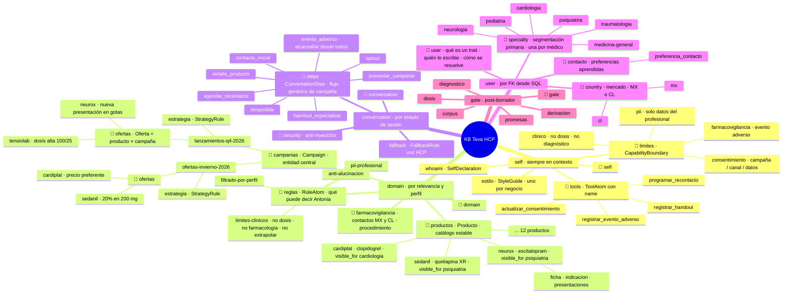
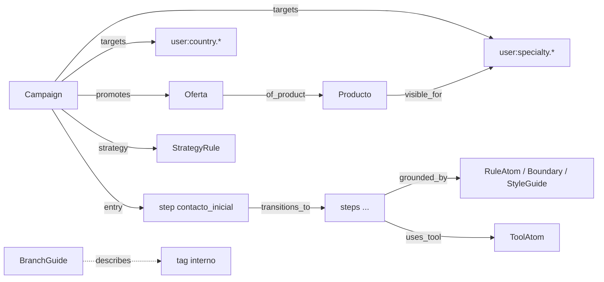

# Ontología de la KB HCP — propuesta (borrador 2026-09-09)

Propuesta de cómo se ve la KB nueva, pensada en campañas y sin herencia del PSP ni de
Vitali/Don Peppe. Responde tres preguntas: si las familias siguen siendo las mismas, si
los traits varían por campaña, y si hay algo por estilo. Y corrige una debilidad de la
KB actual: solo hay nodos en las hojas del árbol; ningún nodo explica qué son sus hijos.

## 1. Las familias no cambian; cambia lo que hay adentro

Las familias no son del negocio, son **ejes de activación del runtime**
(`knowledge_base/taxonomy/retrieval-architecture.md` §2): cada una se recupera con una
lógica distinta. Eso se mantiene en cualquier negocio.

| Familia | Se activa por | Qué cambia en HCP |
|---|---|---|
| `self:` | siempre | identidad Antonia-para-HCP, un solo estilo, límites regulatorios, tools con `name` |
| `domain:` | relevancia a la pregunta **y perfil del médico** | se reorganiza alrededor de **campañas** (entidad central), con catálogo de productos estable y reglas |
| `conversation:` | estado de sesión | un flujo genérico de campaña; se agrega el step de evento adverso |
| `user:` | FK desde SQL | traits del médico: especialidad, país, preferencia de contacto |
| `gate:` | post-borrador | los cinco criterios, reescritos en voz HCP |

Transversales sin nodos propios: `system:teva-hcp`, `channel:whatsapp`, `status:` (estado
MLR del contenido; hoy se usa y no está declarado en `tag-namespaces.yaml`).

## 2. Nodos internos con guía: cada rama explica a sus hijos

Hoy el mindmap muestra `user → traits → especialidad` y solo la hoja tiene documento.
Nada dice qué es un trait, quién lo escribe (form vs perfilador), cómo lo resuelve el
compilador ni qué NO va ahí. Las explicaciones existen, pero fuera de la KB
(`knowledge_base/taxonomy/atoms/atom-trait-atom.md`, `tag-namespaces.yaml`).

Propuesta: un modelo nuevo **`BranchGuide`** (cumple la heurística 2 de la guía de
modelación: comportamiento de compilación distinto). Es un documento **tagueado con el
tag interno** de la rama (`user:specialty`, `domain:campanias`, `self:limites`), con los
mismos campos que ya usa `tag-namespaces.yaml` para los namespaces, bajados un nivel:

| Campo | Contenido |
|---|---|
| `meaning` | qué es esta rama y qué modelo tienen sus hijos |
| `children_are` | qué representa cada hijo (ej. "una especialidad médica; una por médico") |
| `use_when` / `do_not_use_when` | criterio para agregar un hijo acá y no en otra rama |
| `runtime_use` | cómo lo usa el compilador o el agente (ej. "se cruza con `Campaign.targets`") |
| `written_by` | quién crea hijos: negocio (MLR), perfilador, form, reflector |

Comportamiento: **nunca entra al bundle como hecho**. Lo leen el mindmap (el nodo
interno deja de estar vacío), el ruteador (su framing se arma con las guías de rama en
vez de texto suelto en `agent-hcp-router`), el reflector (para proponer hijos en la rama
correcta) y las personas. En el mindmap se marca con 📘.

## 3. El árbol propuesto

## 4. Relaciones (aristas tipadas de kgdb)

Regla de compilación (hoy no existe en código):
`bundle = campaña activa del médico ∩ ofertas cuyo producto es visible_for su especialidad
∩ mercado = su país` + guardarraíles + step activo. Sin especialidad o sin campaña activa
no se presenta ningún producto: se pregunta o se deriva.

## 5. Respuestas directas

**¿Las cuatro familias son las mismas?** Sí. `self`, `domain`, `conversation`, `user`
(y `gate`) son ejes de activación del runtime, no del negocio. Lo que cambia es la forma
interna de `domain` (campaña como raíz, catálogo aparte, reglas aparte) y de `user`
(especialidad y país como ramas propias, no como hojas sueltas de `traits`).

**¿El trait varía según campaña?** No. Un trait es una característica del **médico**,
estable entre campañas: especialidad, país, preferencia de contacto. La campaña no posee
traits: **declara un segmento** como combinación de traits (`Campaign.targets`). Lo que sí
es por campaña es el **estado de la relación** (pendiente, contactado, interesado,
recontacto con fecha, baja de esta campaña), y eso vive en SQL como membresía
médico × campaña, no en la KB. El consentimiento tampoco es trait: es estado en SQL
(tabla de consentimientos) que el runtime revisa antes de abrir un turno; en la KB solo
está el boundary que dice cómo comportarse. Una campaña nueva puede requerir un trait
nuevo (ej. "prescribe biológicos"); se agrega al catálogo de `user:` y queda disponible
para todas.

**¿Hay algo por estilo?** Un solo `StyleGuide` por negocio: la voz de Antonia con
médicos no cambia entre campañas. Lo que varía por campaña es la **estrategia**
(`StrategyRule`: objetivo, enfoque, prioridades; ej. lanzamiento vs oferta de temporada
vs invitación a congreso). Si un tipo de campaña necesitara otro registro, sería una
`StrategyRule` con `phrase_preferences`, no un segundo estilo.

## 6. Cambios de modelo que implica

| Hoy | Propuesta | Por qué |
|---|---|---|
| campaña = `DomainAtom` con tag `domain:campanias.*` | modelo `Campaign` (nombre, vigencia, mercados, targets, estado, mlr_ref) | forma de campo distinta; el compilador la cruza con el perfil |
| oferta = `DomainAtom` con tag `.oferta` bajo el producto | modelo `Oferta` (campaña, producto, condición, vigencia) | pertenece a la campaña, no al producto |
| producto = 4 `DomainAtom` (ficha, indicación, presentaciones, oferta) | modelo `Producto` (molécula, indicación, presentaciones, status MLR) + `visible_for` | una ficha, no cuatro; renderizable en bloques |
| nada | modelo `BranchGuide` en cada nodo interno | los nodos internos explican a sus hijos |
| `user:traits.especialidad` + `user:specialty.*` (dos ramas para lo mismo) | `user:specialty.*` y `user:country.*` | una rama por dimensión de segmentación |
| sin step ni tool de AE | `step evento_adverso` + `registrar_evento_adverso` + `domain:farmacovigilancia` con contactos MX/CL | la misión lo exige y hoy no tiene a dónde ir |
| fallback, reglas y gates en voz de paciente; `domain_ref: psp-selfix`; allowlist Selfix | reescritos en voz HCP; sin residuos | contaminación del negocio anterior |
