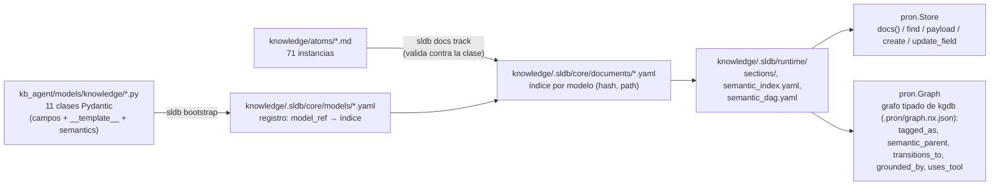
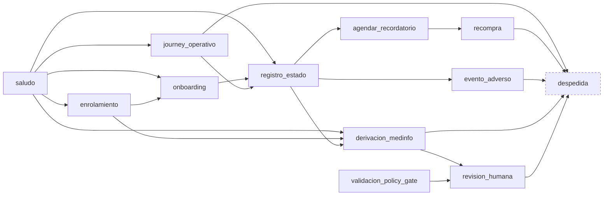
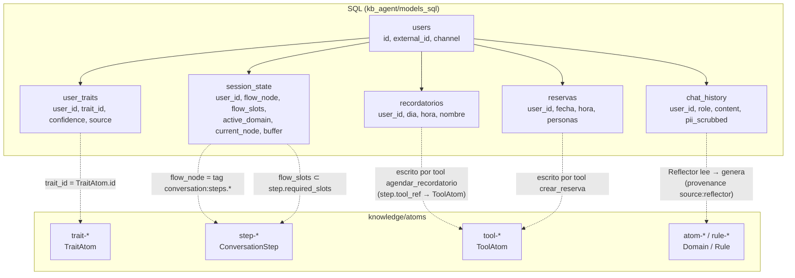

# Modelo de knowledge: documentos, relaciones, agentes y SQL

Estado: **descripción del sistema actual + inconsistencias** (2026-08-27).
Escrito a mano. Complementa `AGENT-CONTRACTS.md` (qué recibe cada agente);
este documento cubre **qué son los documentos, cómo se relacionan entre sí,
y cómo se conectan con los agentes y con SQL**.

Todo lo que dice "hoy" está verificado contra `dev @ 0586fad` (§9), salvo
lo que corrige el bloque siguiente.

> **Estado 2026-09-08 (migración a kgdb/sldb/pron, commits `e400b6b`,
> `a5d2622`, `10e75d0`).** Lo que este documento describía como
> inconsistencias 1, 2, 3 y 9 de §8 ya no existe, porque la capa que las
> producía se reemplazó por las librerías del ecosistema:
>
> - **El flujo conversacional es un grafo tipado de kgdb.** Las transiciones,
>   el grounding y la tool de cada step son `RelationDoc`
>   (`knowledge/relations/*.md`: `transitions_to`, `grounded_by`, `uses_tool`),
>   con sus tipos en `knowledge/relations/types/` y los 11 estructurales en
>   `knowledge/kgdb/relation_types/`. `ConversationStep` ya no tiene
>   `allowed_transitions`, `grounding_atoms` ni `tool_ref`. El ingest tipado
>   rechaza referencias colgantes. Migración: `scripts/migrate_step_relations.py`.
> - **Un `pron.World` por proceso** (`kb_agent/knowledge/world.py`) abre el
>   store y refresca el grafo cuando cambian los hashes; `ConversationFlow`
>   (`kb_agent/knowledge/flow.py`) es la vista del diagrama que consumen el
>   compilador, el orquestador y `export_flow`. `SLDBReader` y `KGDBReader`
>   no existen más.
> - **Los embeddings no van en el frontmatter.** `IndexProxies` perdió
>   `embedding`, `parent` y `semantic_anchors`; los vectores viven en el
>   `DocumentIndex` de pron (`<kb>/.pron/docs.<embedder>.json`, keyed por
>   `hash_c`, fuera de git). `knowledge index embeddings` lo (re)construye
>   embebiendo solo lo que cambió; `index hierarchy` desapareció (la jerarquía
>   la deriva sldb y kgdb la expone como `semantic_parent`).
> - **Toda escritura al store pasa por `pron.Store`** (`propose`, `promote`,
>   `organize`, reflector): sin subprocess al CLI de sldb.
>
> Las secciones §1, §1.1, §2, §4.2 y §7 se actualizaron abajo; el resto del
> análisis (familias, nombres, namespaces, SQL) sigue vigente.

---

## 1. Qué es un documento de knowledge

Un documento es un archivo Markdown con **frontmatter YAML tipado + cuerpo
en secciones**. El frontmatter lleva los campos indexables; el cuerpo lleva
los campos de texto largo, uno por sección `## `. Ambos son campos del mismo
modelo Pydantic: la sección `## Answer` *es* el campo `answer`.

```markdown
---
id: atom-antonia-aplicacion
title: Administración de Selfix
five_wh_one_plus: how
atom_type: domain            # ← tipo: decide qué modelo lo valida
tags:
- domain:tratamiento
- conversation:steps.recompra
- system:laboratorio-chile
domain_ref: psp-selfix
provenance: null
summary: Cómo administrar Selfix correctamente; ...
---

# Administración de Selfix

## Answer

Recordar la aplicación semanal según el día y hora de la persona. ...
```

El tipo lo da `atom_type` en el frontmatter, **no la carpeta**: los
documentos viven planos en `knowledge/atoms/` (75 hoy), y las relaciones
tipadas entre ellos en `knowledge/relations/` (`RelationDoc` de kgdb). El nombre de archivo sigue
la convención `<prefijo>-antonia-<slug>.md` donde el prefijo coincide con el
tipo (`atom-`, `rule-`, `step-`, `trait-`, `gate-`, ...), pero eso es
convención, no lo que lee el sistema.

### 1.1 Ciclo de vida: de la clase al índice



- **Clase** (`*.py`): declara campos, cuáles son obligatorios, el
  `__template__` que dicta el layout del `.md`, y `semantics`
  (`type.knowledge.<tipo>`, `workspace.knowledge`).
- **Registro** (`core/models/*.yaml`): une nombre de modelo con
  `model_ref` importable y con su índice de documentos.
- **Instancia** (`*.md`): se trackea con `sldb docs track`, que la valida
  contra la clase. Un `.md` que no cumple el modelo no entra al índice.
- **Runtime**: `semantic_index.yaml` (búsqueda por semantics/tags),
  `semantic_dag.yaml` (jerarquía de tags: `conversation:steps` →
  `conversation:steps.onboarding`, ...), `sections/` (cuerpo por sección).
- **Readers**: `pron.Store` lee y escribe documentos por la librería de sldb; `pron.Graph`
  construye un grafo dirigido con documentos y tags como nodos.

**Hoy — deuda:** los `path:` en `core/models/*.yaml` apuntan a
`/home/jp/proyectos/_worktrees/gemini_test-kb/...`, un checkout que ya no
existe. Se resuelve por `model_ref`, así que funciona, pero es residuo.

---

## 2. Campos comunes a todos los documentos

Todos los modelos heredan de `IndexProxies` + `StructuredNLDoc`. Campos
compartidos (`*` = obligatorio):

| Campo | Tipo | Para qué | Hoy |
|---|---|---|---|
| `id` * | str | identidad; es lo que SQL y otros docs referencian | ok |
| `title` * | str | nombre legible; se renderiza como `# título` | ok |
| `tags` | `list[ns:valor]` | **relación horizontal principal**; búsqueda | ok, 71/71 |
| `summary` * | str | resumen corto para índice y listados | ok, 71/71 |
| ~~`embedding`~~ | — | **quitado** (2026-09-08): el vector vive en el `DocumentIndex` de pron, keyed por `hash_c` | — |
| ~~`parent`~~ | — | **quitado**: la jerarquía es `semantic_parent` en el grafo, derivada de los tags | — |
| ~~`semantic_anchors`~~ | — | **quitado**: nunca se pobló | — |
| `provenance` | str | de dónde salió (`source:reflector`, sesión, etc.) | 60/71 |

`domain_ref` (37/71) y `five_wh_one_plus` (43/71) son de algunos modelos,
no de la base. `domain_ref` vale siempre `psp-selfix`: hoy no discrimina.

---

## 3. Catálogo: los 11 tipos de documento

Ordenado por **familia** (§3.1), que es el eje que organiza todo lo demás.

| Familia | Tipo (`atom_type`) | Modelo | N | Campos propios (`*` obligatorio) | Secciones del cuerpo | Rol |
|---|---|---|---|---|---|---|
| `self` | `self` | `SelfDeclaration` | 1 | `statement`* | Statement | quién es el agente |
| `self` | `style` | `StyleGuide` | 1 | `tone`*, `language_register`*, `phrase_preferences`, `length_guidelines` | Tone, Language Register, ... | estilo de redacción |
| `self` | `boundary` | `CapabilityBoundary` | 2 | `restriction`*, `conditions`, `escalation` | Restriction, Conditions, Escalation | límite duro de lo que el agente puede hacer |
| `self` | `tool` | `ToolAtom` | 1 | `description`*, `parameters`* | Description, Parameters | declaración de una tool para el LLM |
| `domain` | `domain` | `DomainAtom` | 32 | `five_wh_one_plus`*, `answer`*, `domain_ref` | Answer | hecho del negocio; grounding de respuestas |
| `domain` | `rule` | `RuleAtom` | 11 | `five_wh_one_plus`*, `answer`*, `conditions`, `applies_to` | Answer, Conditions | regla condicional (clasificación, seguridad, anti-alucinación) |
| `conversation` | `step` | `ConversationStep` | 12 | `kind`, `instructions`*, `required_slots`, `handout_target`, `completion_condition`, `domain_ref`; transiciones, grounding y tool son **aristas** (`transitions_to`, `grounded_by`, `uses_tool`) | Instructions, Required Slots, Handout Target, Tool, Allowed Transitions, Grounding Atoms, Completion Condition | nodo del flujo conversacional |
| `conversation` | `strategy` | `StrategyRule` | 1 | `goal`*, `approach`*, `priorities` | Goal, Approach, Priorities | estrategia conversacional |
| `conversation` | `fallback` | `FallbackRule` | 1 | `fallback_message`*, `conditions` | Fallback Message, Conditions | qué decir cuando no hay corpus |
| `user` | `trait` | `TraitAtom` | 5 | `description`*, `category` | Description | rasgo aprendible del usuario; candidato para el perfilador |
| `gate` | `gate` | `GateCriterion` | 5 | `criterion`*, `approval_condition`*, `rejection_action`* | Criterion, Approval Condition, Rejection Action | criterio post-redacción del gate |

`self`, `style`, `strategy`, `fallback` y `tool` son **singletons de
configuración**: una KB = un negocio = uno de cada. El resto son
**colecciones**.

### 3.1 `family`: el eje de propiedad

Cada modelo declara una **familia** como `ClassVar` — no es un campo del
frontmatter, se declara por clase y no se deriva en runtime
(`models/knowledge/index_proxies.py:38-43`):

```python
class DomainAtom(IndexProxies):
    __family__ = "domain"
```

Cinco familias para once tipos:

| Familia | Modelos | Qué es |
|---|---|---|
| `self` | SelfDeclaration, StyleGuide, CapabilityBoundary, **ToolAtom** | lo que el agente **es**: identidad, estilo, límites y capacidades |
| `domain` | DomainAtom, RuleAtom | lo que el agente **sabe** del negocio |
| `conversation` | ConversationStep, StrategyRule, FallbackRule | cómo se **conduce** la conversación |
| `user` | TraitAtom | lo que se **aprende** del usuario |
| `gate` | GateCriterion | lo que **valida** la respuesta |

Dos cosas que la familia resuelve y el `atom_type` no:

1. **Es el eje de carga base por agente.** Cada familia tiene un agente
   que la carga como contexto fijo antes del turno: `self` → conversador
   (persona + tools), `conversation` → orquestador (flujo, estrategia,
   fallback), `user` → perfil (juntura con SQL), `gate` → gate. `domain` no
   tiene base: entra solo cuando el ruteador lo trae. Es el mapeo limpio
   que `AGENT-CONTRACTS.md` §2 necesitaba y que por `atom_type` queda
   disperso en 11 filas.

   Ojo con la lectura inversa: la familia **no** limita lo que el ruteador
   puede meter al bundle de un turno. El ruteador selecciona sobre las 11
   colecciones — un `TraitAtom` si el paciente dice que está ansioso, un
   `ConversationStep` vecino si la pregunta abre una rama, un `ToolAtom` si
   pregunta por agendar — con un motivo por documento. Familia = quién lo
   tiene de base; justificación = por qué entra hoy.
2. **Es la raíz del árbol de tags.** El comentario del código lo dice:
   "recupera el origen taxonómico que tenían los átomos originales
   (namespace antes del ':')". Un doc de familia `domain` *debería* llevar
   tags `domain:*`; uno de familia `conversation`, tags `conversation:*`.

Nota: `ToolAtom` es familia `self`, no `conversation`. Las tools son
capacidades del agente, no pasos del flujo — el step las *referencia*
(arista `uses_tool`), no las posee.

**Hoy — la familia se declara una vez y se pierde en cada consumidor:**

| Consumidor | Cómo obtiene la familia | Resultado |
|---|---|---|
| registro del store (`core/models/*.yaml`) | campo `family:` de SLDB | **`null` en los 11** — `bootstrap` no lee `__family__` |
| grafo tipado de kgdb (`node_type` = nombre del modelo) | `has_model` / `extends` desde el registro | la familia sigue solo en la clase (`__family__`) |
| índices runtime (`semantic_index`, `semantic_dag`) | — | 0 menciones |
| `/api/taxonomy` (`frontends/chat/app.py:224`) | `MODEL_MAP` **hardcodeado** | duplica `__family__` a mano (y ya divergió: hubo que agregar `gate` por separado) |
| `Orchestrator._semantic_role` (`orchestrator.py:384`) | **prefijo del tag** (`self:` > `domain:` > `conversation:`) | un `RuleAtom` (familia `domain`) con tags `conversation:security` sale como `conversation.security` |
| Turn Inspector (`chat/index.html:95`, `familiaDe`) | prefijo del tag | agrupa por tag, no por familia; `FAM_COLORS` no conoce `gate` |
| `taxonomy/index.html:55` (`FAM`) | hardcodeado | 4 familias, sin `gate` |

El único lugar que la conoce de verdad es la clase. Todo lo demás la
reconstruye por otro camino (registro nulo, prefijo de tag, mapa a mano) y
cada reconstrucción diverge un poco. En el contexto real medido (§5.1), de
43 atoms 10 aparecen como familia `conversation` cuando son `RuleAtom` de
familia `domain`.

### 3.2 Átomo vs documento: el overlap

La palabra "átomo" está sobrecargada en la KB. Hoy nombra tres cosas
distintas, y la confusión se ve en carpetas, campos, clases y vocabulario.

**Lo que los datos dicen.** Solo dos modelos tienen la forma de un átomo —
una pregunta (`five_wh_one_plus`) y una respuesta (`answer`):

| Modelo | Se llama `*Atom` | Tiene 5W1H + `answer` | Es átomo |
|---|---|---|---|
| `DomainAtom` | sí | sí | **sí** (32) |
| `RuleAtom` | sí | sí | **sí** (11) |
| `TraitAtom` | **sí** | no | no |
| `ToolAtom` | **sí** | no | no |
| `ConversationStep`, `GateCriterion`, `CapabilityBoundary`, `StyleGuide`, `StrategyRule`, `SelfDeclaration`, `FallbackRule` | no | no | no |

Es decir: **43 de los 71 documentos son átomos**. Los otros 28 son pasos,
criterios, límites, estilo, estrategia, identidad, tools y traits —
documentos estructurados de otra naturaleza, que comparten base
(`StructuredNLDoc`) e índice, pero no son unidades pregunta-respuesta.

**Dónde se mezcla:**

| Lugar | Qué dice | Qué debería decir |
|---|---|---|
| carpeta `knowledge/atoms/` | contiene los 71 | son documentos; 43 son átomos |
| campo `atom_type: step` / `gate` / `style` | un step "es un tipo de átomo" | es un tipo de **documento** (`doc_type`) |
| clases `TraitAtom`, `ToolAtom` | son átomos | no tienen pregunta ni respuesta |
| aristas `grounded_by` del step | apuntan a `self-antonia`, `style-antonia`, reglas... | son documentos de grounding, no átomos |
| `gate_atoms` (`orchestrator.py:277`) | los criterios del gate son átomos | son `GateCriterion` |
| "71 atoms", `_find_atoms`, `atom_ids` | todo documento es un átomo | — |
| `knowledge/tag-namespaces.yaml` (antes `knowledge/desk/atoms/tag-namespaces.yaml`) | era una copia del vocabulario de deskops (`layer`, `source`, `system:deskops`, `topic:atoms`) | hoy define el vocabulario de **esta** KB (§4.1) |

Y hay una **tercera** acepción fuera de knowledge: `desk/atoms/` (deskops,
modelo `AtomDoc`) son átomos de *arquitectura del proyecto*. Tienen
exactamente la misma forma que `DomainAtom` — `id, title,
five_wh_one_plus, tags, provenance, answer` — pero viven en otro store, con
otro modelo, y con su propio `desk/atoms/tag-namespaces.yaml`. El archivo
de namespaces que vivía dentro de `knowledge/desk/` era ese vocabulario
copiado: definía `layer` y `source` (que ningún documento de negocio usa) y
no definía `conversation`, `self`, `user` ni `channel` (que 42 documentos
usan). Ya no existe: lo reemplazó `knowledge/tag-namespaces.yaml`.

**Cómo ordenarlo.** Un criterio y tres consecuencias:

- **Documento** = cualquier instancia de los 11 modelos. **Átomo** =
  documento con pregunta y respuesta (`DomainAtom`, `RuleAtom`). "Átomo"
  queda reservado para eso; el resto se nombra por lo que es.
- **Renombrar lo que miente**: `atom_type` → `doc_type`; `TraitAtom` →
  `UserTrait`; `ToolAtom` → `ToolDeclaration`; `_find_atoms` → `_find_docs`; `knowledge/atoms/` →
  `knowledge/docs/` (o una carpeta por familia). Es un rename mecánico,
  pero toca modelos, 71 frontmatters, readers y UI; hacerlo de una vez y
  con `sldb docs track --force` para reindexar.
- **Los namespaces salen de las familias, no de deskops.** El comentario de
  `__family__` ya lo dice: la familia es "el namespace antes del `:`". Las
  cinco familias (`self`, `conversation`, `domain`, `user`, `gate`) **son**
  los namespaces raíz de esta KB; `system`, `topic` y `channel` son
  transversales. **Hecho:** el archivo vive en `knowledge/tag-namespaces.yaml`,
  describe *estos* namespaces (cinco familias + `system`, `topic`, `channel`)
  y `knowledge/desk/` ya no existe.
- **`desk/atoms` y `knowledge` DomainAtom son el mismo concepto en dos
  stores.** Es legítimo que estén separados (arquitectura del proyecto vs
  conocimiento del negocio), pero deberían compartir una base `Atom` para
  que la forma no divierja. Decisión pendiente, no urgente.

---

## 4. Relaciones entre documentos

Hay dos familias de relación: **genéricas** (cualquier doc con cualquier
doc) y **tipadas** (declaradas por un modelo concreto, con semántica propia).

### 4.1 Genéricas

| Relación | Mecanismo | Aristas en KGDB | Lector hoy |
|---|---|---|---|
| comparte tag | `tags` | `tagged_as`, `semantic_parent` | `pron.Graph` (`sources`, `children`, `neighbors_via`) vía `KnowledgeOperations.explore` |
| flujo | `RelationDoc` | `transitions_to`, `grounded_by`, `uses_tool` | `ConversationFlow` (`kb_agent/knowledge/flow.py`) |
| similitud | `DocumentIndex` (`.pron/`, fuera del documento) | — | `KnowledgeOperations.semantic_search` / `rank_among` |

#### Namespaces de tags

Definidos en `knowledge/tag-namespaces.yaml` vs. uso real en los
71 documentos (la columna *Definido* refleja el archivo actual; los tres
`**no**` de la versión anterior se cerraron al mover el archivo):

| Namespace | Definido | Usado (docs) | Ejemplo | Nota |
|---|---|---|---|---|
| `system` | sí | 71 | `system:laboratorio-chile` | constante; no discrimina |
| `domain` | sí | 35 | `domain:seguridad.triage` | jerárquico por `.` |
| `conversation` | sí | 31 | `conversation:steps.onboarding` | **el más importante, sin definir** |
| `topic` | sí | 6 | `topic:rules` | |
| `gate` | sí | 5 | `gate:corpus` | |
| `self` | sí | 5 | `self:whoami` | |
| `user` | sí | 5 | `user:trait` | |
| `channel` | **no** | 1 | | |
| `layer` | sí | 0 | | definido, sin uso |
| `source` | sí | 0 | | definido, sin uso (reflector debería usarlo) |

**Cuatro namespaces en uso no están definidos**, incluido `conversation`,
que es el eje del flujo. El archivo de namespaces describe otra KB (la de
`desk/`), no ésta.

### 4.2 Tipadas: el flujo conversacional

Desde 2026-09-08 el flujo es un **grafo tipado de kgdb**. Cada relación es
un documento `RelationDoc` del store (`knowledge/relations/*.md`) con
`source_id`/`target_id` en formato `Modelo:nombre`, y cada tipo un
`RelationTypeDoc` (`knowledge/relations/types/`) que fija qué clases pueden
ser sujeto y objeto, cardinalidad, eje y condición por defecto:

| Relación | Sujeto → objeto | Cardinalidad | Eje | Aristas hoy |
|---|---|---|---|---|
| `transitions_to` | `ConversationStep` → `ConversationStep` | many_to_many | WHEN | 20 |
| `grounded_by` | `ConversationStep` → cualquier documento | many_to_many | WHY | 31 |
| `uses_tool` | `ConversationStep` → `ToolAtom` | many_to_one | HOW | 0 |

`kgdb ingest --store` (lo corre `World.refresh_if_stale` al arrancar el
runtime y tras cada escritura) valida cada arista contra su tipo: una
transición a un step que no existe, o con un sujeto que no es
`ConversationStep`, es un **error de ensamblaje**, no un typo silencioso.
Antes las transiciones eran texto libre en `## Allowed Transitions`
(partido por coma, con placeholders como "ninguna (paso terminal)") y el
compilador filtraba a mano las referencias colgantes.

Quién las lee: `ConversationFlow` (`kb_agent/knowledge/flow.py`) sobre
`pron.Graph`: `transitions(tag)`, `grounding(tag)` (aristas `grounded_by`
más los documentos que llevan el tag del step), `entry()` (raíz del grafo
por `transitions_to`, prefiriendo `.onboarding`), `resolve_active(current)`.
El compilador, el orquestador (`allowed_transitions` del contexto del
turno, que la guardia `apply_transition_guard` sigue vetando por código) y
`frontends/flow_editor/export_flow.py` usan esa vista.

El grafo declarado en los 12 steps de Antonia:



`validacion_policy_gate` sigue sin entrada declarada: es el checkpoint
post-draft, no un nodo del flujo del usuario.

---

## 5. Documentos ↔ agentes

Cruce de los 11 tipos con los cuatro agentes del diseño (más perfilador y
reflector, que no son agentes de turno). **F** = contexto fijo, cargado al
arrancar; **D** = dinámico, seleccionado por turno.

| Tipo | Conversador | Ruteador de contexto | Orquestador | Gate | Perfilador | Reflector |
|---|---|---|---|---|---|---|
| `self`, `style`, `boundary` | **F** (persona) | | | | | |
| `strategy` | **F** | | | | | |
| `fallback` | **F** | | **F** (decide fallback) | | | |
| `domain` | D (lo que entrega el ruteador) | **D** busca | | | | escribe nuevos |
| `rule` | D | **D** busca | D (clasificación) | | | |
| `step` | D (instrucciones del step activo) | **D** step actual + grounding | **F** flow completo | | | |
| `tool` | | | **F** tools disponibles | | | |
| `gate` | | | | **F** | | |
| `trait` | D (perfil del usuario, vía SQL) | **D** busca (p. ej. ansiedad) | | | **F** candidatos | |

La columna **Ruteador de contexto** marca los casos típicos, no un límite:
el ruteador puede meter al bundle un documento de **cualquier** fila si lo
justifica (`AGENT-CONTRACTS.md` §2.0, regla 2). Lo que no puede es meterlo
sin motivo.

### 5.1 Quién los lee hoy (código)

| Tipo | Consumidor actual | Cómo |
|---|---|---|
| `domain`, `rule` | `ContextCompiler._find_atoms` (`compiler.py:73-74`) | **todos**, sin selección |
| `self`, `style`, `boundary` | `_extract_persona` (`compiler.py:190-226`) | singleton → `persona` |
| `strategy` | `_extract_strategy` (`:228`) | singleton |
| `fallback` | `_extract_fallback` (`:242`) | singleton |
| `tool` | `_find_tools` (`:249`) | todos → `function_declarations` |
| `step` | `_augment_from_kgdb` (`:274`) vía KGDB | step activo + hermanos (ver §4.2) |
| `trait` | `TraitExtractor` (`perfilador/extractor.py:75`, `reader.fetch("trait")`) | candidatos → LLM elige → SQL |
| `gate` | `Orchestrator._validate_response` (`orchestrator.py:277`) | lee los 5, decide con heurísticas de string |

La columna "Ruteador de contexto" de la tabla 5 está vacía en el código:
ese agente no existe (ver `AGENT-CONTRACTS.md` §2.2).

---

## 6. Documentos ↔ SQL

SQL no guarda conocimiento; guarda **estado por usuario** que *referencia*
conocimiento. Todas las junturas son **strings sin integridad referencial**:
SQL no sabe que el id existe en la KB, y renombrar un documento deja filas
colgando.



| Columna SQL | Referencia en KB | Quién escribe | Quién lee | Validación |
|---|---|---|---|---|
| `user_traits.trait_id` | `TraitAtom.id` (`trait-antonia-*`) | perfilador (post-turno) | compilador → `persona`/perfil | ninguna |
| `session_state.flow_node` | tag `conversation:steps.<step>` | orquestador (post-turno) | compilador → step activo | `current_step in steps`, si no cae a onboarding |
| `session_state.flow_slots` | claves de `step.required_slots` | orquestador | compilador → `missing_slots` | ninguna |
| `session_state.active_domain` | valor de tag `domain:*` | orquestador | compilador → `scenario` (solo etiqueta) | ninguna |
| `recordatorios.*` / `reservas.*` | — (efecto de `ToolAtom`) | tool handler | nadie del runtime | — |
| `chat_history.*` | — | orquestador | **reflector** (batch, offline) | — |

Dos cosas que SQL **no** tiene y el diseño necesita:

- **Sesión / conversación**: `chat_history` es una lista plana por usuario.
  No hay `session_id`.
- **Rastro de turno**: qué documentos entraron al contexto, qué step estaba
  activo, qué decidió el gate. Se calcula en cada turno y se pierde.

Con eso, el vínculo documento ↔ turno (que es lo que haría auditable una
respuesta pasada) **no existe en SQL**; sólo existe en la respuesta HTTP
mientras dura.

---

## 7. Cómo se busca (los readers)

Tres librerías del ecosistema y una capa de negocio encima. Nada en el
runtime abre un `.md` ni arma un grafo por su cuenta.

### pron.World / pron.Store — el store

`kb_agent/knowledge/world.py::open_world(kb_root)` abre **un `World` por
proceso**: corre `kgdb init` si el store nunca lo tuvo y
`refresh_if_stale()` (sldb `stores update` + ingest tipado de kgdb a
`<kb>/.pron/graph.nx.json`) cuando cambiaron los hashes de los modelos.
`world.store` es la única puerta a sldb: `docs()`, `find(scope, where)`,
`payload(model, name)`, `create`, `update_field`, `track`/`untrack`, con
roundtrip y paths relativos a la raíz de la KB.

### pron.Graph — el grafo tipado de kgdb

Lee el grafo persistido sin networkx: `edges_from/edges_to`, `targets/
sources`, `nodes_of_type`, `roots`, `children/parent/descendants`,
`neighbors_via`. Nodos: documentos (`sldb://document/Modelo:nombre`, con
`node_type` = modelo), tags (`sldb://semantic_tag/<tag>`), modelos, campos,
secciones y tipos de relación. Aristas estructurales (`tagged_as`,
`semantic_parent`, `has_model`, `has_field`, `extends`, ...) y autoradas
(`transitions_to`, `grounded_by`, `uses_tool`).

### pron.embedder.DocumentIndex — similitud

`KnowledgeOperations.document_index()`: vectores en
`<kb>/.pron/docs.<embedder>.json`, keyed por `hash_c` del documento, así
que re-indexar embebe solo lo que cambió. El `Embedder` es un puerto
inyectable; el runtime usa `kb_agent/knowledge/embedder.py::FastembedEmbedder`
(`jinaai/jina-embeddings-v2-base-es`, 768d); sin fastembed cae a difflib
avisando una vez. Consumidores: `semantic_search` (compilador y ruteador),
`rank_among` (perfilador, top-k de traits), `document_vectors`
(`/api/viz/graph`).

### KnowledgeOperations — la capa de negocio (`knowledge_base/`)

Lo que las librerías no saben del negocio: cruce con SQL (`traits`),
contrato de runtime de los documentos (`doc`, `docs_by_type`,
`docs_by_tag`), curación (`propose`, `promote`, `organize`, `reflect`) y el
índice de embeddings. CLI: `python -m knowledge_base --kb knowledge <cmd>`.
Subcomandos: `explore show traits self propose organize index embeddings
index audit promote reflect`.

| Operación | Agente | Devuelve |
|---|---|---|
| `explore_multi(query, max=10)` | ruteador | docs rankeados por el `DocumentIndex` (`weak` bajo 0.25) + hermanos por tag en el grafo, `top_score`, `is_empty` |
| `explore(tag= / atom=)` | ruteador | navegación del grafo: raíces, hijos, vecinos |
| `traits(user_id)` | ruteador / conversador | traits del usuario **resueltos contra el `TraitAtom`** (título, descripción, categoría, confianza) |
| `self_context()` | conversador | identidad, estilo, límites |
| `show(atom_id)` | cualquiera | un documento resuelto |
| `index_embeddings()`, `audit_embeddings()` | offline | (re)construye el `DocumentIndex` y reporta documentos sin vector |
| `propose`, `promote`, `reflect`, `organize` | reflector / curación | alta y promoción de documentos |

**Hoy:** `Orchestrator` crea **una** `KnowledgeOperations` por proceso
(sobre el `World` único) y la inyecta al compilador, al `RouterAgent`
(tools `explore_multi`/`explore`/`show`) y al perfilador.

---

## 8. Inconsistencias encontradas

Por orden de impacto sobre el comportamiento:

0. **`family` declarada en la clase y perdida en todos los consumidores**
   (§3.1). Es el eje de propiedad por agente y la raíz del árbol de tags,
   y hoy el registro la tiene en `null`, el runtime la deriva del prefijo
   del tag, y las UIs la hardcodean. Antes que cualquier retrieval o
   ruteador, este eje tiene que propagarse: registro → KGDB → contexto →
   UI, desde `__family__` y no desde heurísticas.
0b. **"Átomo" nombra tres cosas** (§3.2): el documento pregunta-respuesta
   (43/71), cualquier documento de knowledge (carpeta, `atom_type`,
   `grounding_atoms`, `TraitAtom`/`ToolAtom`), y el átomo de arquitectura
   de deskops (`desk/atoms`, cuyo `tag-namespaces.yaml` estuvo copiado
   dentro de `knowledge/desk/` hasta que lo reemplazó
   `knowledge/tag-namespaces.yaml`, ya derivado de las familias). Queda el
   rename mecánico.
0c. ~~Dos capas de acceso a knowledge~~ **Resuelto**: el runtime usa
   `KnowledgeOperations` sobre `pron.World`; no hay segundo lector.
1. ~~Transiciones y grounding declarados pero no cableados~~ **Resuelto
   2026-09-08**: son aristas tipadas de kgdb (§4.2), validadas en ensamblaje.
2. ~~Sin selección de `domain`/`rule`~~ **Resuelto**: el `RouterAgent` arma
   el bundle con `explore_multi` sobre el `DocumentIndex` (§7).
3. ~~`semantic_anchors` vacío~~ **Resuelto**: quitado del modelo.
4. **Namespaces de tags desincronizados** (§4.1): `conversation`, `self`,
   `user`, `channel` en uso sin definición; `layer`, `source` definidos sin
   uso. El archivo describe la KB de `desk/`, no ésta.
5. **Junturas SQL↔KB sin validación** (§6). Nada detecta un `trait_id` o
   `flow_node` huérfano.
6. **`validacion_policy_gate` es inalcanzable** en el grafo declarado
   (ningún step transiciona a él) y el gate real no navega a ningún step.
7. **`domain_ref` y `system:` constantes.** No discriminan nada mientras
   haya un solo negocio por KB; son ruido en cada documento.
8. **Registro con rutas de un worktree borrado** (§1.1).
9. ~~`parent` a medias~~ **Resuelto**: quitado del modelo; la jerarquía es
   `semantic_parent` en el grafo (derivada de los tags por sldb).

---

## 9. Cómo se verificó

- Campos por modelo: introspección de `model_fields` de las 11 clases en
  `kb_agent.models.knowledge`.
- Uso de campos y tags: parseo del frontmatter de los 71 `.md`.
- Transiciones declaradas: `RelationDoc` en `knowledge/relations/` (antes,
  sección `## Allowed Transitions` de cada `step-*.md`).
- Consumidores: `grep type.knowledge.<tipo>|fetch("<tipo>")` sobre
  `kb_agent/`, más lectura de `compiler.py`, `knowledge/flow.py`,
  `orchestrator.py`, `perfilador/extractor.py`.
- Namespaces: `knowledge/tag-namespaces.yaml` vs. conteo real.
- SQL: `kb_agent/models_sql/*.py` y `PRAGMA table_info` sobre
  `runs/local-chat.sqlite`.
