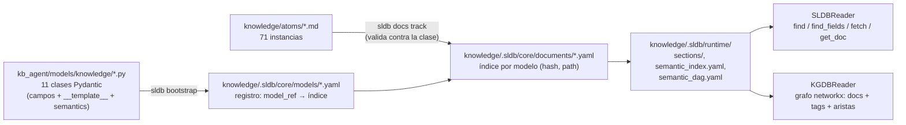
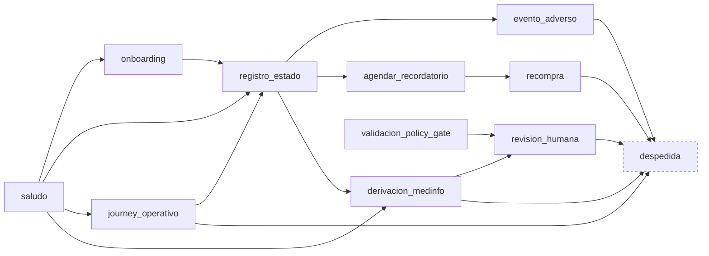
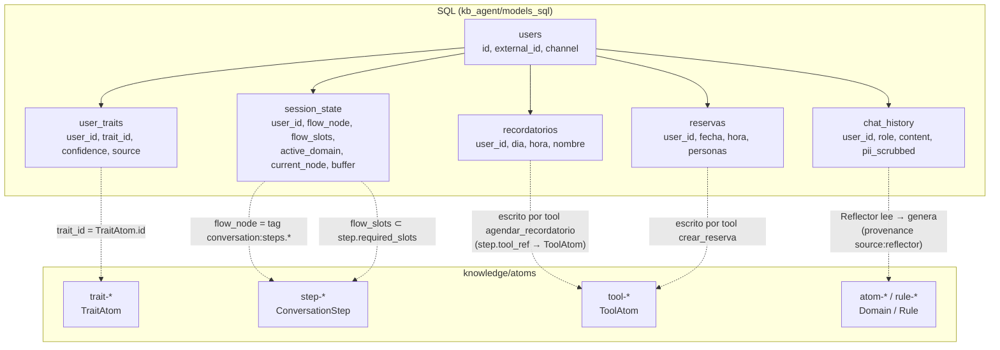

# Modelo de knowledge: documentos, relaciones, agentes y SQL

Estado: **descripción del sistema actual + inconsistencias** (2026-08-27).
Escrito a mano. Complementa `AGENT-CONTRACTS.md` (qué recibe cada agente);
este documento cubre **qué son los documentos, cómo se relacionan entre sí,
y cómo se conectan con los agentes y con SQL**.

Todo lo que dice "hoy" está verificado contra `dev @ 0586fad` (§9).

---

## 1. Qué es un documento de knowledge

Un documento es un archivo Markdown con **frontmatter YAML tipado + cuerpo
en secciones**. El frontmatter lleva los campos indexables; el cuerpo lleva
los campos de texto largo, uno por sección `## `. Ambos son campos del mismo
modelo Pydantic: la sección `## Answer` *es* el campo `answer`.

```markdown
---
id: atom-antonia-aplicacion
title: Administración de Selfix
five_wh_one_plus: how
atom_type: domain            # ← tipo: decide qué modelo lo valida
tags:
- domain:tratamiento
- conversation:steps.recompra
- system:laboratorio-chile
domain_ref: psp-selfix
provenance: null
summary: Cómo administrar Selfix correctamente; ...
embedding: [-0.022079, ...]  # 768d, jina-embeddings-v2-base-es
parent: null
semantic_anchors: null
---

# Administración de Selfix

## Answer

Recordar la aplicación semanal según el día y hora de la persona. ...
```

El tipo lo da `atom_type` en el frontmatter, **no la carpeta**: los 71
documentos viven planos en `knowledge/atoms/`. El nombre de archivo sigue
la convención `<prefijo>-antonia-<slug>.md` donde el prefijo coincide con el
tipo (`atom-`, `rule-`, `step-`, `trait-`, `gate-`, ...), pero eso es
convención, no lo que lee el sistema.

### 1.1 Ciclo de vida: de la clase al índice



- **Clase** (`*.py`): declara campos, cuáles son obligatorios, el
  `__template__` que dicta el layout del `.md`, y `semantics`
  (`type.knowledge.<tipo>`, `workspace.knowledge`).
- **Registro** (`core/models/*.yaml`): une nombre de modelo con
  `model_ref` importable y con su índice de documentos.
- **Instancia** (`*.md`): se trackea con `sldb docs track`, que la valida
  contra la clase. Un `.md` que no cumple el modelo no entra al índice.
- **Runtime**: `semantic_index.yaml` (búsqueda por semantics/tags),
  `semantic_dag.yaml` (jerarquía de tags: `conversation:steps` →
  `conversation:steps.onboarding`, ...), `sections/` (cuerpo por sección).
- **Readers**: `SLDBReader` busca por término semántico; `KGDBReader`
  construye un grafo dirigido con documentos y tags como nodos.

**Hoy — deuda:** los `path:` en `core/models/*.yaml` apuntan a
`/home/jp/proyectos/_worktrees/gemini_test-kb/...`, un checkout que ya no
existe. Se resuelve por `model_ref`, así que funciona, pero es residuo.

---

## 2. Campos comunes a todos los documentos

Todos los modelos heredan de `IndexProxies` + `StructuredNLDoc`. Campos
compartidos (`*` = obligatorio):

| Campo | Tipo | Para qué | Hoy |
|---|---|---|---|
| `id` * | str | identidad; es lo que SQL y otros docs referencian | ok |
| `title` * | str | nombre legible; se renderiza como `# título` | ok |
| `tags` | `list[ns:valor]` | **relación horizontal principal**; búsqueda | ok, 71/71 |
| `summary` * | str | resumen corto para índice y listados | ok, 71/71 |
| `embedding` | `list[float]` | vector 768d para similitud contra la query | poblado 71/71, **nadie lo lee** |
| `parent` | str (id) | jerarquía | 23/71 con padre, sin lector |
| `semantic_anchors` | `list[str]` | anclas semánticas explícitas | **vacío en 71/71** |
| `provenance` | str | de dónde salió (`source:reflector`, sesión, etc.) | 60/71 |

`domain_ref` (37/71) y `five_wh_one_plus` (43/71) son de algunos modelos,
no de la base. `domain_ref` vale siempre `psp-selfix`: hoy no discrimina.

---

## 3. Catálogo: los 11 tipos de documento

Ordenado por **familia** (§3.1), que es el eje que organiza todo lo demás.

| Familia | Tipo (`atom_type`) | Modelo | N | Campos propios (`*` obligatorio) | Secciones del cuerpo | Rol |
|---|---|---|---|---|---|---|
| `self` | `self` | `SelfDeclaration` | 1 | `statement`* | Statement | quién es el agente |
| `self` | `style` | `StyleGuide` | 1 | `tone`*, `language_register`*, `phrase_preferences`, `length_guidelines` | Tone, Language Register, ... | estilo de redacción |
| `self` | `boundary` | `CapabilityBoundary` | 2 | `restriction`*, `conditions`, `escalation` | Restriction, Conditions, Escalation | límite duro de lo que el agente puede hacer |
| `self` | `tool` | `ToolAtom` | 1 | `description`*, `parameters`* | Description, Parameters | declaración de una tool para el LLM |
| `domain` | `domain` | `DomainAtom` | 32 | `five_wh_one_plus`*, `answer`*, `domain_ref` | Answer | hecho del negocio; grounding de respuestas |
| `domain` | `rule` | `RuleAtom` | 11 | `five_wh_one_plus`*, `answer`*, `conditions`, `applies_to` | Answer, Conditions | regla condicional (clasificación, seguridad, anti-alucinación) |
| `conversation` | `step` | `ConversationStep` | 11 | `kind`, `instructions`*, `required_slots`, `handout_target`, `tool_ref`, `allowed_transitions`, `grounding_atoms`, `completion_condition`, `domain_ref` | Instructions, Required Slots, Handout Target, Tool, Allowed Transitions, Grounding Atoms, Completion Condition | nodo del flujo conversacional |
| `conversation` | `strategy` | `StrategyRule` | 1 | `goal`*, `approach`*, `priorities` | Goal, Approach, Priorities | estrategia conversacional |
| `conversation` | `fallback` | `FallbackRule` | 1 | `fallback_message`*, `conditions` | Fallback Message, Conditions | qué decir cuando no hay corpus |
| `user` | `trait` | `TraitAtom` | 5 | `description`*, `category` | Description | rasgo aprendible del usuario; candidato para el perfilador |
| `gate` | `gate` | `GateCriterion` | 5 | `criterion`*, `approval_condition`*, `rejection_action`* | Criterion, Approval Condition, Rejection Action | criterio post-redacción del gate |

`self`, `style`, `strategy`, `fallback` y `tool` son **singletons de
configuración**: una KB = un negocio = uno de cada. El resto son
**colecciones**.

### 3.1 `family`: el eje de propiedad

Cada modelo declara una **familia** como `ClassVar` — no es un campo del
frontmatter, se declara por clase y no se deriva en runtime
(`models/knowledge/index_proxies.py:38-43`):

```python
class DomainAtom(IndexProxies):
    __family__ = "domain"
```

Cinco familias para once tipos:

| Familia | Modelos | Qué es |
|---|---|---|
| `self` | SelfDeclaration, StyleGuide, CapabilityBoundary, **ToolAtom** | lo que el agente **es**: identidad, estilo, límites y capacidades |
| `domain` | DomainAtom, RuleAtom | lo que el agente **sabe** del negocio |
| `conversation` | ConversationStep, StrategyRule, FallbackRule | cómo se **conduce** la conversación |
| `user` | TraitAtom | lo que se **aprende** del usuario |
| `gate` | GateCriterion | lo que **valida** la respuesta |

Dos cosas que la familia resuelve y el `atom_type` no:

1. **Es el eje de carga base por agente.** Cada familia tiene un agente
   que la carga como contexto fijo antes del turno: `self` → conversador
   (persona + tools), `conversation` → orquestador (flujo, estrategia,
   fallback), `user` → perfil (juntura con SQL), `gate` → gate. `domain` no
   tiene base: entra solo cuando el ruteador lo trae. Es el mapeo limpio
   que `AGENT-CONTRACTS.md` §2 necesitaba y que por `atom_type` queda
   disperso en 11 filas.

   Ojo con la lectura inversa: la familia **no** limita lo que el ruteador
   puede meter al bundle de un turno. El ruteador selecciona sobre las 11
   colecciones — un `TraitAtom` si el paciente dice que está ansioso, un
   `ConversationStep` vecino si la pregunta abre una rama, un `ToolAtom` si
   pregunta por agendar — con un motivo por documento. Familia = quién lo
   tiene de base; justificación = por qué entra hoy.
2. **Es la raíz del árbol de tags.** El comentario del código lo dice:
   "recupera el origen taxonómico que tenían los átomos originales
   (namespace antes del ':')". Un doc de familia `domain` *debería* llevar
   tags `domain:*`; uno de familia `conversation`, tags `conversation:*`.

Nota: `ToolAtom` es familia `self`, no `conversation`. Las tools son
capacidades del agente, no pasos del flujo — el step las *referencia*
(`tool_ref`), no las posee.

**Hoy — la familia se declara una vez y se pierde en cada consumidor:**

| Consumidor | Cómo obtiene la familia | Resultado |
|---|---|---|
| registro del store (`core/models/*.yaml`) | campo `family:` de SLDB | **`null` en los 11** — `bootstrap` no lee `__family__` |
| `KGDBReader` (`kgdb_reader.py:140`) | `m.family` del registro | `null` en el grafo |
| índices runtime (`semantic_index`, `semantic_dag`) | — | 0 menciones |
| `/api/taxonomy` (`frontends/chat/app.py:224`) | `MODEL_MAP` **hardcodeado** | duplica `__family__` a mano (y ya divergió: hubo que agregar `gate` por separado) |
| `Orchestrator._semantic_role` (`orchestrator.py:384`) | **prefijo del tag** (`self:` > `domain:` > `conversation:`) | un `RuleAtom` (familia `domain`) con tags `conversation:security` sale como `conversation.security` |
| Turn Inspector (`chat/index.html:95`, `familiaDe`) | prefijo del tag | agrupa por tag, no por familia; `FAM_COLORS` no conoce `gate` |
| `taxonomy/index.html:55` (`FAM`) | hardcodeado | 4 familias, sin `gate` |

El único lugar que la conoce de verdad es la clase. Todo lo demás la
reconstruye por otro camino (registro nulo, prefijo de tag, mapa a mano) y
cada reconstrucción diverge un poco. En el contexto real medido (§5.1), de
43 atoms 10 aparecen como familia `conversation` cuando son `RuleAtom` de
familia `domain`.

### 3.2 Átomo vs documento: el overlap

La palabra "átomo" está sobrecargada en la KB. Hoy nombra tres cosas
distintas, y la confusión se ve en carpetas, campos, clases y vocabulario.

**Lo que los datos dicen.** Solo dos modelos tienen la forma de un átomo —
una pregunta (`five_wh_one_plus`) y una respuesta (`answer`):

| Modelo | Se llama `*Atom` | Tiene 5W1H + `answer` | Es átomo |
|---|---|---|---|
| `DomainAtom` | sí | sí | **sí** (32) |
| `RuleAtom` | sí | sí | **sí** (11) |
| `TraitAtom` | **sí** | no | no |
| `ToolAtom` | **sí** | no | no |
| `ConversationStep`, `GateCriterion`, `CapabilityBoundary`, `StyleGuide`, `StrategyRule`, `SelfDeclaration`, `FallbackRule` | no | no | no |

Es decir: **43 de los 71 documentos son átomos**. Los otros 28 son pasos,
criterios, límites, estilo, estrategia, identidad, tools y traits —
documentos estructurados de otra naturaleza, que comparten base
(`StructuredNLDoc`) e índice, pero no son unidades pregunta-respuesta.

**Dónde se mezcla:**

| Lugar | Qué dice | Qué debería decir |
|---|---|---|
| carpeta `knowledge/atoms/` | contiene los 71 | son documentos; 43 son átomos |
| campo `atom_type: step` / `gate` / `style` | un step "es un tipo de átomo" | es un tipo de **documento** (`doc_type`) |
| clases `TraitAtom`, `ToolAtom` | son átomos | no tienen pregunta ni respuesta |
| `grounding_atoms` del step | lista `step-antonia-onboarding` y `self-antonia` | son documentos de grounding, no átomos |
| `gate_atoms` (`orchestrator.py:277`) | los criterios del gate son átomos | son `GateCriterion` |
| "71 atoms", `_find_atoms`, `atom_ids` | todo documento es un átomo | — |
| `knowledge/tag-namespaces.yaml` (antes `knowledge/desk/atoms/tag-namespaces.yaml`) | era una copia del vocabulario de deskops (`layer`, `source`, `system:deskops`, `topic:atoms`) | hoy define el vocabulario de **esta** KB (§4.1) |

Y hay una **tercera** acepción fuera de knowledge: `desk/atoms/` (deskops,
modelo `AtomDoc`) son átomos de *arquitectura del proyecto*. Tienen
exactamente la misma forma que `DomainAtom` — `id, title,
five_wh_one_plus, tags, provenance, answer` — pero viven en otro store, con
otro modelo, y con su propio `desk/atoms/tag-namespaces.yaml`. El archivo
de namespaces que vivía dentro de `knowledge/desk/` era ese vocabulario
copiado: definía `layer` y `source` (que ningún documento de negocio usa) y
no definía `conversation`, `self`, `user` ni `channel` (que 42 documentos
usan). Ya no existe: lo reemplazó `knowledge/tag-namespaces.yaml`.

**Cómo ordenarlo.** Un criterio y tres consecuencias:

- **Documento** = cualquier instancia de los 11 modelos. **Átomo** =
  documento con pregunta y respuesta (`DomainAtom`, `RuleAtom`). "Átomo"
  queda reservado para eso; el resto se nombra por lo que es.
- **Renombrar lo que miente**: `atom_type` → `doc_type`; `TraitAtom` →
  `UserTrait`; `ToolAtom` → `ToolDeclaration`; `grounding_atoms` →
  `grounding_docs`; `_find_atoms` → `_find_docs`; `knowledge/atoms/` →
  `knowledge/docs/` (o una carpeta por familia). Es un rename mecánico,
  pero toca modelos, 71 frontmatters, readers y UI; hacerlo de una vez y
  con `sldb docs track --force` para reindexar.
- **Los namespaces salen de las familias, no de deskops.** El comentario de
  `__family__` ya lo dice: la familia es "el namespace antes del `:`". Las
  cinco familias (`self`, `conversation`, `domain`, `user`, `gate`) **son**
  los namespaces raíz de esta KB; `system`, `topic` y `channel` son
  transversales. **Hecho:** el archivo vive en `knowledge/tag-namespaces.yaml`,
  describe *estos* namespaces (cinco familias + `system`, `topic`, `channel`)
  y `knowledge/desk/` ya no existe.
- **`desk/atoms` y `knowledge` DomainAtom son el mismo concepto en dos
  stores.** Es legítimo que estén separados (arquitectura del proyecto vs
  conocimiento del negocio), pero deberían compartir una base `Atom` para
  que la forma no divierja. Decisión pendiente, no urgente.

---

## 4. Relaciones entre documentos

Hay dos familias de relación: **genéricas** (cualquier doc con cualquier
doc) y **tipadas** (declaradas por un modelo concreto, con semántica propia).

### 4.1 Genéricas

| Relación | Mecanismo | Aristas en KGDB | Lector hoy |
|---|---|---|---|
| comparte tag | `tags` | `doc → tag`, `tag → tag` (`semantic_parent`) | `docs_for_tag`, `siblings`, `steps_under` |
| jerarquía | `parent` | — | ninguno |
| ancla semántica | `semantic_anchors` | — | ninguno (y está vacío) |
| similitud | `embedding` | — | ninguno |

#### Namespaces de tags

Definidos en `knowledge/tag-namespaces.yaml` vs. uso real en los
71 documentos (la columna *Definido* refleja el archivo actual; los tres
`**no**` de la versión anterior se cerraron al mover el archivo):

| Namespace | Definido | Usado (docs) | Ejemplo | Nota |
|---|---|---|---|---|
| `system` | sí | 71 | `system:laboratorio-chile` | constante; no discrimina |
| `domain` | sí | 35 | `domain:seguridad.triage` | jerárquico por `.` |
| `conversation` | sí | 31 | `conversation:steps.onboarding` | **el más importante, sin definir** |
| `topic` | sí | 6 | `topic:rules` | |
| `gate` | sí | 5 | `gate:corpus` | |
| `self` | sí | 5 | `self:whoami` | |
| `user` | sí | 5 | `user:trait` | |
| `channel` | **no** | 1 | | |
| `layer` | sí | 0 | | definido, sin uso |
| `source` | sí | 0 | | definido, sin uso (reflector debería usarlo) |

**Cuatro namespaces en uso no están definidos**, incluido `conversation`,
que es el eje del flujo. El archivo de namespaces describe otra KB (la de
`desk/`), no ésta.

### 4.2 Tipadas: el flujo conversacional

`ConversationStep` declara tres relaciones con semántica propia. `KGDBReader`
tiene métodos para leerlas como aristas tipadas… **pero esas aristas no
existen en el grafo**:

| Campo del step | Apunta a | Arista que el lector espera | Método lector | ¿Funciona? |
|---|---|---|---|---|
| `allowed_transitions` | otros steps (por tag) | `REL_FLOWS_TO` | `get_next_transitions(node)` | **no**, devuelve `[]` |
| `grounding_atoms` | ids de `domain`/`self`/... | `REL_GROUNDED_BY` | `get_grounding_atoms(node)` | **no**, devuelve `[]` |
| `tool_ref` | id de `tool` | — | `get_tools_for_node(node)` | no verificado |

El ingest SLDB→KGDB (`kgdb.ingest.sldb`, en `hum-ecosystem/tools/kgdb`) sólo
produce un grafo **tag-céntrico**: `tagged_as` y `semantic_parent`. Nunca
emite `flows_to` ni `grounded_by`. Comprobado llamando
`get_next_transitions()` sobre los 11 steps de `knowledge/.sldb`: `[]` en
todos.

Por eso la **única fuente real** de las transiciones es el campo tipado
`ConversationStep.allowed_transitions` leído directamente del documento
(texto libre: `"conversation:steps.registro_estado"`, o placeholders como
`"ninguna (paso terminal)"`). Hasta la fase 1.1 sólo lo leía
`frontends/flow_editor/export_flow.py` para dibujar el editor de flujo.

Y el grafo declarado en los 11 steps, tal como está en los documentos:



Es un flujo real, con entrada (`saludo`), salida (`despedida`, terminal) y
ramas de seguridad (`evento_adverso`, `derivacion_medinfo` →
`revision_humana`). `validacion_policy_gate` no tiene entrada declarada
desde ningún step: es el nodo al que el gate debería saltar, pero nadie
transiciona a él.

**Resuelto en fase 1.1** (commit `c82764c`): `_augment_from_kgdb` parsea el
campo declarado del step vía `SLDBReader`, y `allowed_transitions` pasa a ser
lo que el step declara. `grounding_atoms` sigue por `docs_for_tag` (esa vía
sí funciona, es tag-céntrica). El texto que sigue describe el estado previo,
que era éste:

**Antes — el bug de cableado:** el compilador no usa ninguna de estas
aristas. `_augment_from_kgdb` (`compiler.py:274-316`) llama a
`steps_under()` y expone como transiciones permitidas *todos los hermanos*,
y usa `docs_for_tag()` en vez de `get_grounding_atoms()`. Resultado: desde
`despedida` (terminal) el runtime cree que puede ir a cualquiera de los
otros 10 steps. El grafo declarado y sus lectores existen; falta llamarlos.

---

## 5. Documentos ↔ agentes

Cruce de los 11 tipos con los cuatro agentes del diseño (más perfilador y
reflector, que no son agentes de turno). **F** = contexto fijo, cargado al
arrancar; **D** = dinámico, seleccionado por turno.

| Tipo | Conversador | Ruteador de contexto | Orquestador | Gate | Perfilador | Reflector |
|---|---|---|---|---|---|---|
| `self`, `style`, `boundary` | **F** (persona) | | | | | |
| `strategy` | **F** | | | | | |
| `fallback` | **F** | | **F** (decide fallback) | | | |
| `domain` | D (lo que entrega el ruteador) | **D** busca | | | | escribe nuevos |
| `rule` | D | **D** busca | D (clasificación) | | | |
| `step` | D (instrucciones del step activo) | **D** step actual + grounding | **F** flow completo | | | |
| `tool` | | | **F** tools disponibles | | | |
| `gate` | | | | **F** | | |
| `trait` | D (perfil del usuario, vía SQL) | **D** busca (p. ej. ansiedad) | | | **F** candidatos | |

La columna **Ruteador de contexto** marca los casos típicos, no un límite:
el ruteador puede meter al bundle un documento de **cualquier** fila si lo
justifica (`AGENT-CONTRACTS.md` §2.0, regla 2). Lo que no puede es meterlo
sin motivo.

### 5.1 Quién los lee hoy (código)

| Tipo | Consumidor actual | Cómo |
|---|---|---|
| `domain`, `rule` | `ContextCompiler._find_atoms` (`compiler.py:73-74`) | **todos**, sin selección |
| `self`, `style`, `boundary` | `_extract_persona` (`compiler.py:190-226`) | singleton → `persona` |
| `strategy` | `_extract_strategy` (`:228`) | singleton |
| `fallback` | `_extract_fallback` (`:242`) | singleton |
| `tool` | `_find_tools` (`:249`) | todos → `function_declarations` |
| `step` | `_augment_from_kgdb` (`:274`) vía KGDB | step activo + hermanos (ver §4.2) |
| `trait` | `TraitExtractor` (`perfilador/extractor.py:75`, `reader.fetch("trait")`) | candidatos → LLM elige → SQL |
| `gate` | `Orchestrator._validate_response` (`orchestrator.py:277`) | lee los 5, decide con heurísticas de string |

La columna "Ruteador de contexto" de la tabla 5 está vacía en el código:
ese agente no existe (ver `AGENT-CONTRACTS.md` §2.2).

---

## 6. Documentos ↔ SQL

SQL no guarda conocimiento; guarda **estado por usuario** que *referencia*
conocimiento. Todas las junturas son **strings sin integridad referencial**:
SQL no sabe que el id existe en la KB, y renombrar un documento deja filas
colgando.



| Columna SQL | Referencia en KB | Quién escribe | Quién lee | Validación |
|---|---|---|---|---|
| `user_traits.trait_id` | `TraitAtom.id` (`trait-antonia-*`) | perfilador (post-turno) | compilador → `persona`/perfil | ninguna |
| `session_state.flow_node` | tag `conversation:steps.<step>` | orquestador (post-turno) | compilador → step activo | `current_step in steps`, si no cae a onboarding |
| `session_state.flow_slots` | claves de `step.required_slots` | orquestador | compilador → `missing_slots` | ninguna |
| `session_state.active_domain` | valor de tag `domain:*` | orquestador | compilador → `scenario` (solo etiqueta) | ninguna |
| `recordatorios.*` / `reservas.*` | — (efecto de `ToolAtom`) | tool handler | nadie del runtime | — |
| `chat_history.*` | — | orquestador | **reflector** (batch, offline) | — |

Dos cosas que SQL **no** tiene y el diseño necesita:

- **Sesión / conversación**: `chat_history` es una lista plana por usuario.
  No hay `session_id`.
- **Rastro de turno**: qué documentos entraron al contexto, qué step estaba
  activo, qué decidió el gate. Se calcula en cada turno y se pierde.

Con eso, el vínculo documento ↔ turno (que es lo que haría auditable una
respuesta pasada) **no existe en SQL**; sólo existe en la respuesta HTTP
mientras dura.

---

## 7. Cómo se busca (los readers)

### SLDBReader — búsqueda por semántica

```python
reader.find("type.knowledge.domain")      # todos los DomainAtom
reader.find("conversation:steps.onboarding")  # docs con ese tag
reader.fetch("trait")                      # azúcar de find("type.knowledge.trait")
reader.find_fields(term)                   # también secciones y campos, no solo docs
reader.get_doc(doc_id)                     # campos resueltos de un doc
```

El eje `type.knowledge.<tipo>` sale del `semantics` de la clase, no de un
tag. Por eso `atom_type` es campo del modelo y no tag.

**Hoy:** estas funciones son internas. No están expuestas como tools al
LLM, así que ningún agente puede *buscar*; sólo el compilador *carga*.

### KGDBReader — grafo

Nodos: documentos y tags (`tag:<ns>:<valor>`). Aristas: `doc → tag`,
`tag → tag` (`semantic_parent`, desde `semantic_dag.yaml`), y las tipadas
del step (`REL_FLOWS_TO`, `REL_GROUNDED_BY`). Métodos: `steps_under`,
`docs_for_tag`, `siblings`, `get_next_transitions`, `get_grounding_atoms`,
`get_tools_for_node`.

### KnowledgeOperations — herramientas por agente (`knowledge_base/`)

Tercera capa, la de más alto nivel: envuelve SLDB + KGDB + SQL en
operaciones con semántica de agente. CLI: `python -m knowledge_base --kb
knowledge <cmd>`. Subcomandos: `explore show step traits self context
propose organize index embeddings hierarchy promote reflect`.

| Operación | Agente | Devuelve |
|---|---|---|
| `explore_multi(query, threshold=0.3, max=10)` | ruteador | docs rankeados: similitud de embeddings + fuzzy (×0.85) + 3 vecinos KGDB por doc, `top_score`, `is_empty` |
| `explore(tag= / atom=)` | ruteador | navegación del grafo: raíces, hijos, vecinos |
| `step_next(user_id)` | orquestador | `flow_node` (SQL) + `allowed_transitions` y `grounding_atoms` por aristas tipadas + `missing_slots` |
| `traits(user_id)` | ruteador / conversador | traits del usuario **resueltos contra el `TraitAtom`** (título, descripción, categoría, confianza) |
| `self_context()` | conversador | identidad, estilo, límites |
| `context(user_id)` | ruteador | bundle por usuario |
| `show(atom_id)` | cualquiera | un documento resuelto |
| `index_embeddings()`, `index_hierarchy()` | offline | escribe `embedding` (jina-v2-base-es, 768d) y `parent` |
| `propose`, `promote`, `reflect`, `organize` | reflector / curación | alta y promoción de documentos |

**Hoy:** `kb_agent` **no importa `knowledge_base`** (el único consumidor,
`frontends/viz/export_graph.py`, fue eliminado). La dependencia va en un
solo sentido: `knowledge_base → kb_agent.models`. Está más reciente en git
que el ontologizador y sus 21 tests pasan. Es la capa que pobló los
embeddings y la única que los lee. El runtime tiene, en paralelo, una
versión más pobre de lo mismo (§5.1): carga todo, hermanos en vez de
transiciones, traits como id.

---

## 8. Inconsistencias encontradas

Por orden de impacto sobre el comportamiento:

0. **`family` declarada en la clase y perdida en todos los consumidores**
   (§3.1). Es el eje de propiedad por agente y la raíz del árbol de tags,
   y hoy el registro la tiene en `null`, el runtime la deriva del prefijo
   del tag, y las UIs la hardcodean. Antes que cualquier retrieval o
   ruteador, este eje tiene que propagarse: registro → KGDB → contexto →
   UI, desde `__family__` y no desde heurísticas.
0b. **"Átomo" nombra tres cosas** (§3.2): el documento pregunta-respuesta
   (43/71), cualquier documento de knowledge (carpeta, `atom_type`,
   `grounding_atoms`, `TraitAtom`/`ToolAtom`), y el átomo de arquitectura
   de deskops (`desk/atoms`, cuyo `tag-namespaces.yaml` estuvo copiado
   dentro de `knowledge/desk/` hasta que lo reemplazó
   `knowledge/tag-namespaces.yaml`, ya derivado de las familias). Queda el
   rename mecánico.
0c. **Dos capas de acceso a knowledge, y el runtime usa la peor** (§7).
   `knowledge_base.KnowledgeOperations` resuelve transiciones por el grafo
   tipado, traits como documento y búsqueda con score; el ontologizador
   del runtime hace lo contrario en los tres puntos, y nadie llama a la
   primera. Antes de escribir retrieval nuevo, enchufar la que existe
   (`AGENT-CONTRACTS.md` §7.4).
1. **Transiciones y grounding declarados pero no cableados** (§4.2). El
   flujo está bien modelado en la KB y KGDB lo lee; el compilador usa los
   métodos genéricos en vez de los tipados. Dos líneas.
2. **Sin selección de `domain`/`rule`** (§5.1). Se cargan los 43 en cada
   turno. Los embeddings que resolverían esto están poblados y sin lector.
3. **`semantic_anchors` vacío en 71/71.** O se puebla o se quita del modelo;
   como está, es una promesa falsa en el esquema.
4. **Namespaces de tags desincronizados** (§4.1): `conversation`, `self`,
   `user`, `channel` en uso sin definición; `layer`, `source` definidos sin
   uso. El archivo describe la KB de `desk/`, no ésta.
5. **Junturas SQL↔KB sin validación** (§6). Nada detecta un `trait_id` o
   `flow_node` huérfano.
6. **`validacion_policy_gate` es inalcanzable** en el grafo declarado
   (ningún step transiciona a él) y el gate real no navega a ningún step.
7. **`domain_ref` y `system:` constantes.** No discriminan nada mientras
   haya un solo negocio por KB; son ruido en cada documento.
8. **Registro con rutas de un worktree borrado** (§1.1).
9. **`parent` a medias** (23/71): la jerarquía `farmacovigilancia → {ea,
   gamp5, ime, meddra, triage}` existe pero nadie la recorre.

---

## 9. Cómo se verificó

- Campos por modelo: introspección de `model_fields` de las 11 clases en
  `kb_agent.models.knowledge`.
- Uso de campos y tags: parseo del frontmatter de los 71 `.md`.
- Transiciones declaradas: sección `## Allowed Transitions` de los 11
  `step-*.md`.
- Consumidores: `grep type.knowledge.<tipo>|fetch("<tipo>")` sobre
  `kb_agent/`, más lectura de `compiler.py`, `kgdb_reader.py`,
  `orchestrator.py`, `perfilador/extractor.py`.
- Namespaces: `knowledge/tag-namespaces.yaml` vs. conteo real.
- SQL: `kb_agent/models_sql/*.py` y `PRAGMA table_info` sobre
  `runs/local-chat.sqlite`.
